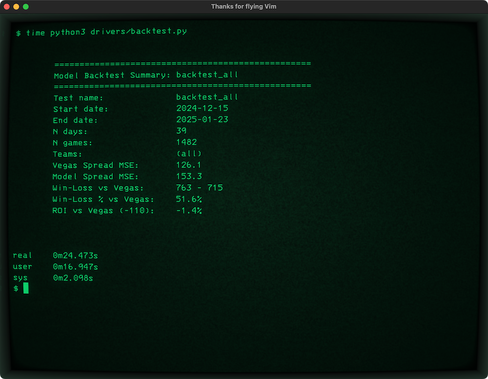

# olsonator


***This library is named for [Lute Olson](https://en.wikipedia.org/wiki/Lute_Olson), basketball coach of the Arizona Wildcats for 25 years (1983–2007). RIP.***

This library contains a model for NCAA basketball,
tools to obtain the data the model needs via web scraping,
and tools to back-test the model against past games
to quantify how well a model performs.

## Overview

This tool primarily uses <https://teamrankings.com> as a source of
data about possessions, offense, and defense. It uses 
<https://github.com/dcstats/CBBpy/> to interface with the NCAA
baskeball API and obtain schedule and spread odds data.

Here is an example of the output of a backtest. Note that this
backtest utilizes 39 days and 1,482 games' worth of data,
and takes < 30 seconds to run (not including one-time processing
cost of downloading and extracting schedule data from the web,
which will be cached on disk for any subsequent run):



## Quick Start

There is no need to install this package, but you will need to install
dependencies. In a Python virtual environment:

```
pip install -r requirements.txt
```

Now you can run any of the example drivers in the `drivers/` folder.

To use the model to make a prediction about a single game:

```
python drivers/model.py
```

To backtest the model against several days of games:

```
python drivers/backtest.py
```


## Required Inputs

If you take a look at `drivers/model.py` you can see the information required
to make a game prediction about a single game, which is fairly minimal:

* Game date (possession/offense/defense data specific to that date will be used)
* Home team
* Away team

Backtesting requires additional information about each game, but it also uses the
CBBpy library and the official NCAAB API to obtain game information, so you don't
have to manually provide any game data.


## Drivers

The `drivers/` folder contains examples and scripts used to drive
the model and model analysis.

* `model.py` - simple example of creating a model anad using it
  to make a prediction about a particular NCAAB game.
  Demonstrates use of a Model Data Harness.

* `backtest.py` - simple example of backtesting a model.

* `n_team_backtest.py` - example of backtesting a model against
  games specifically involving one or more teams.


## Core Package

The `pkg/` folder contains the core library for the model,
model backtester, model data harness, and web scrapers.

This is not a normal pip-installable package, it is intended
to be sidejacked into the drivers so that we can be lazy and
skip an extra build step every time we change the core library.

See lines 7-8 of [drivers/model.py](/drivers/model.py#L7-L8) for specifics.


## Data

The `data/` folder contains data used by the model,
plus any raw and processed data downloaded by web scrapers.


### Team Data

The `data/teams/` directory contains team name data.
This is largely hand-curated, with multiple verisons of team names
from the NCAA API, Kenpom, Sagarin, and others.

See [/data/teams/txt/Readme.md](/data/teams/txt/Readme.md).

*Many Bothans died to bring us these names.*


### Rankings

The model uses several quantities for each team to make its prediction, including:

* Tempo
* Offensive efficiency
* Defensive efficiency

Different sites offer different rankings/values for these quantities:

* <https://teamrankings.com>:
    * [Offensive efficiency](https://www.teamrankings.com/ncaa-basketball/stat/offensive-efficiency/) for year, last 10, last 3, home, away, etc.
    * [Defensive efficiency](https://www.teamrankings.com/ncaa-basketball/stat/defensive-efficiency) 
    * [Possessions per game](https://www.teamrankings.com/ncaa-basketball/stat/possessions-per-game), same as tempo 
    * Can also obtain historical snapshots for doing backtesting of prior years

* TODO: <https://kenpom.com>:
    * Offers an adjusted offensive/defensive efficiency, and tempo
    * The catch: this data is updated each day, historical snapshots are not possible
    * These values are only useful if the model is predicting a game within ~90 days


## Acknowledgement

The author wishes to acknowledge <https://kenpom.com> for blog posts explaining
the model used on that website, <https://teamstats.com> for the NCAAB
statistics and schedule data, <https://github.com/dcstats/CBBpy/> for a
Python library to interface with the NCAA Basketball API, and 
<https://github.com/Swordfish90/cool-retro-term> for the cool retro terminal
in the screenshots.

Special thanks to all of the hard-working men and women and the
talented student athletes who make NCAA basketball not just possible
but highly entertaining.


## Use At Your Own Risk

This software is for entertainment purposes only. As stated in the [LICENSE](/LICENSE) file,

> THE SOFTWARE IS PROVIDED "AS IS", WITHOUT WARRANTY OF ANY KIND, EXPRESS OR IMPLIED
